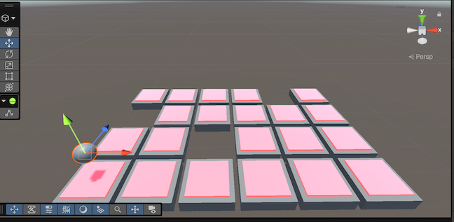
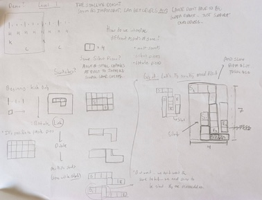
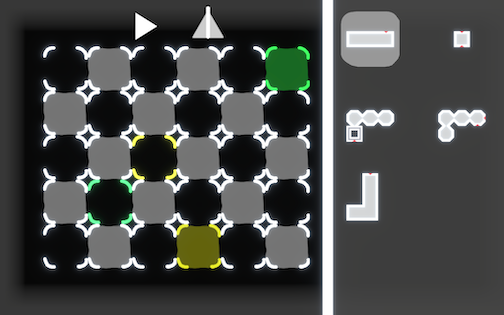
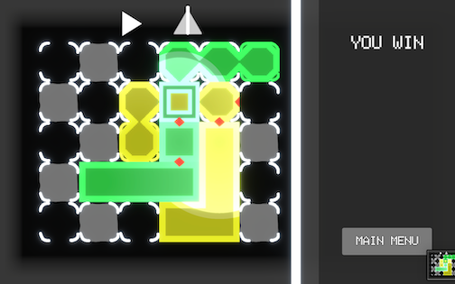
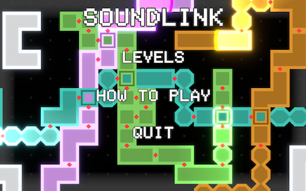
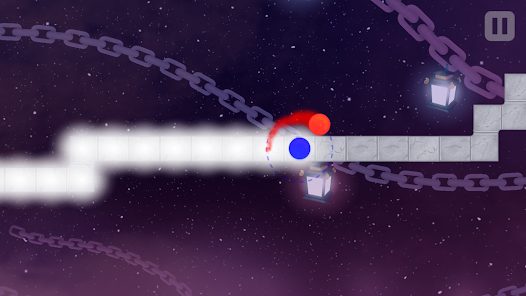
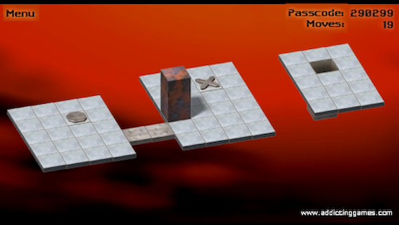
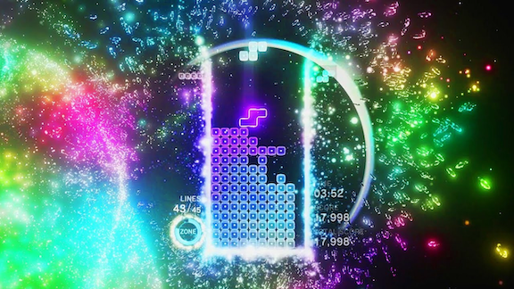

# SoundLink: A Music-Based 2D Puzzle Game
**Jonathan Hagendoorn and James Irwin**

**Advised by Dr. John Clements**

## Introduction
In this paper we introduce SoundLink, a music-based puzzle game that challenges players to solve 2D puzzles through visual and auditory clues. The purpose of this game is to combine traditional puzzle-solving mechanics with musical creativity. The result encourages players to use their own musicality to solve problems and create satisfying drum-based compositions. This report provides an overview of SoundLink, including related works, project development, implementation details, and playtest results. The game’s source code and build files are available through the following GitHub repository and download links:

- [GitHub](https://github.com/jhcsdev/Soundlink ) 
- [Download](https://github.com/jhcsdev/Soundlink/tree/main/BUILDS)

## Project Development
In this section, we review the project’s development across two academic quarters. The development can be separated into two distinct phases, each corresponding to a quarter. During the first quarter, we focused on an initial game concept that, ultimately, proved unenjoyable. As a result, we pivoted to a new direction and spent the second quarter working on SoundLink.  

Our initial game concept was a rhythm-based platformer in which players navigated a 2.5D grid from a designated start tile to an end tile. Each movement across the grid created a sound, with different movement directions corresponding to different sounds. Therefore, by completing a level the player would also create a musical composition. For instance, a level’s movements and sounds could be coupled like so: 

- Forward: Kick
- Left: Snare
- Right: Clap
- Backward: Hi-hat

Thus, if a player moved forward, left, forward, and right, the corresponding sounds would be kick, snare, kick, and clap. In addition to navigating the level correctly, players also had to move in time with a metronome. Otherwise, they would lose the level. Figure 1 shows tile grid that players traversed in our prototype:

We pivoted to a new direction because the game proved unenjoyable. The mechanics were clunky and it was difficult to move in time with the metronome. Additionally, we had not handled concurrent sounds. For instance, a player could not create both a kick and a snare on the same downbeat because it was impossible to move in both directions at the same time. This experience taught us an important lesson: create a playable version of the game as soon as possible. Gameplay is extremely informative and early testing allows for quicker iteration. If we had more quickly developed our platformer to a playable state, we would have had more time to either improve the game or try a different approach. 

After deciding to change directions, we settled on a puzzle game. The goal of this game is to create connections between start and end tiles by placing Tetris-style pieces on a 2D board. Multiple start and end tile pairs can exist on a single board, which requires players to route connections around and through one another to complete the puzzle. Additionally, each connection is associated with a unique sound, so the arrangement of pieces directly affects the resulting musical output. We chose to create a puzzle game because it solved the problems from the platformer: the mechanics were easier to implement and players could use multiple sounds at the same time. With only one academic quarter remaining, we moved quickly into development.

Immediately, our redesign led to smoother development. For instance, we could more easily divide tasks because there were several distinct game components, such as the puzzle grid and the piece inventory. This division allowed us to work on the game in parallel instead of being blocked by one another. We also changed our approach by spending more time designing the game before implementing it. This change decreased our development time because we spent less time thinking through complications and edge cases that we hadn’t considered. Figure 2 shows one of our early level concepts:

Ultimately, we were able to implement most of our goals and create a game that we are both proud of. While more time would have allowed us to create more features, we both consider our game to be functionally complete and fun to play.

## Design
Now that we have reviewed our development process, we describe the design of Soundlink in greater detail. The goal of the game is to create connections between designated start and end tiles by placing Tetris-style pieces on a 2D board. Each start-end tile pair corresponds to a unique sound. As players place tiles within a connection, they extend that sound’s sequence within the overall musical composition.
The size of each piece determines the duration of the corresponding sound. Therefore, longer pieces produce longer notes while shorter pieces produce shorter notes. A player can successfully complete the level by arranging the pieces in a way that connects each start-end tile pair and produces a rhythmically coherent composition.

To guide players toward that goal, each level has a reference composition that contains each of the level’s sounds. Players can listen to this reference track to guide their piece placement. For example, a long duration between two of a sound’s notes may suggest that the player should use a long piece. Alternatively, a short duration between two notes may suggest that the player should use a short piece. By listening to the reference track and analyzing the board, players can combine their visual and auditory skills to solve each puzzle. Figure 3 is a screenshot of Level 4: 

As shown in Figure 3, pieces are contained in the inventory (right) and can be placed on the puzzle grid (left). Each sound has a start and end location on the grid. The start locations are glowing and the end locations are not. By connecting pieces via the red triangles, or “glue,” that exist on some pieces' edges, the player can link start-end pairs, arrange sounds, and complete the level. As previously mentioned, players can use a reference track to guide their arrangements. They can hear this track by pressing the play button on the top left part of the puzzle grid. Players can also use a metronome to better understand the timing of the pieces that they have already placed. The button on the top right part of the puzzle grid controls this metronome. 

As also shown in Figure 3, there are several kinds of pieces. Normal pieces are composed of individual squares. These pieces play their corresponding sound on a looping interval, visualized by bright pulses. These links give each level its own unique eight-beat soundtrack. Silent pieces, on the other hand, do not play any sound and are demarcated by their hexagonal shape. Silent pieces can be placed between non-silent pieces to extend the duration between notes. Finally, pass-through pieces contain a hole in their center and allow another piece to be placed at the same position. The purpose of pass-through pieces is to allow links to cross each other. Figure 4 shows Level 4, now completed:

In all, SoundLink contains six levels. The purpose of the first four levels is to introduce the user to game controls and different piece types, while the last two levels utilize all game mechanics. In addition to the six levels, SoundLink has a title screen and a main menu that displays user controls and explains the game’s purpose. Figure 5 shows the title screen:

## Implementation
Having outlined the design of SoundLink, we now turn our attention to its technical implementation. Our technological needs can be divided into three parts: graphics, animation, and sound. 

We used the Unity engine to handle graphic overhead. By doing so, we did not need to implement our own graphical pipeline [3]. We could also organize state orchestration through the use of MonoBehaviours and handle user control through the Unity Input System. The Unity engine acted as a layer of abstraction between our game logic and lower-level platform and hardware APIs.

We also used the DOTween Unity plugin to streamline procedural animation development. DOTween is a tweening engine that interpolates built-in Unity fields over time [2]. For instance, we can transition both a GameObject’s position and rotation from transform A to transform B over X seconds, and the DOTween plugin handles all of the backend work for us.

Finally, we used ChucK to control sound. ChucK is a strongly-typed, strongly-timed concurrent audio and multimedia programming language developed by Ge Wang and collaborators [4]. By utilizing Chunity, a Unity-specific ChucK plugin, we were able to control the timing of sounds based on Unity events [1].

## Playtest Results
To better understand how players interact with our game, we conducted one round of playtesting with three playtesters. 
Through this testing we discovered several areas for improvement. For example, one problem that all playtesters mentioned was a lack of clarity. Players found it difficult to understand the game’s goal and the methods that were needed to achieve that goal. By working through our four introductory levels, the three playtesters were able to understand that the white pieces needed to connect the two associated colors on the grid. However, red “glue” triangles were consistently ignored or misunderstood. As understanding the function of those red triangles is essential to the game, we reworked the “How to Play” tab in both the main menu and pause menu to explicitly note the existence and function of those red “glue” connections.

Another point that the playtesters mentioned was the complexity of controls. Specifically, our control system was a little overloaded, with multiple keys designated to one specific action and nothing else—like “G” to go to the puzzle and “I” to return to the inventory. These controls only worked while in the opposing grid; that is, “G” had no function while in the puzzle and “I” no function while in the inventory. While these controls are still in the game, we have introduced additional functionality to transition between grids via moving with WASD against the “wall” between the two grids. This makes movement more intuitive.

Overall, however, our playtesters enjoyed the game. Their feedback certainly improved our final product and we appreciate their contributions to this work.

## Related Works
We used several games as reference when creating SoundLink. Our initial platformer, as shown in Figure 1, was partially based on the game A Dance of Fire and Ice, which is a 2D rhythm-based game that follows a similar grid-like structure [5]. In A Dance of Fire and Ice, players control two orbiting discs along a path of overlapping varied-shape tiles to create a metronome-like sound that plays over the level soundtrack. We wanted to bring that consistent, rhythm-focused gameplay into our own game, while removing the addition of outside music tracks overlaid on gameplay. Simply put, we wanted the player’s actions to create the music itself.

Visually, for our initial platformer, we also took inspiration from popular online games like Bloxorz, in which the player is a two-unit tall rectangular prism that must traverse a 2D grid, managing the extra dimension of height in how they flip and fall across the grid [6]. As shown in Figure 7, the 2.5D structure introduced a minimal constraint on height that, while not a true 3D game, allowed more variability in challenges.

After pivoting to our puzzle game, we looked for new inspiration. Since we were now focusing on the concept of 2D, square-grid “pieces,” we found that inspiration in Tetris. Specifically, we used Tetris Effect, a 2018 spinoff of the original Tetris, as a reference because of its special effects [7]. Tetris Effect serves as the closest visual example for what we hoped to create with our game, and though we weren’t able to reach the same breadth of visuals in Tetris Effect as a consequence of both time and experience, it still served as our prime reference. 

## Conclusion
SoundLink is a music-based puzzle game that challenges players to solve 2D puzzles through visual and auditory clues. By combining traditional puzzle-solving mechanics with musical creativity, SoundLink encourages players to use their own musicality to solve problems and create satisfying drum-based compositions. Though our development included a significant pivot, we were able to create a complete game that playtesters enjoyed. Additionally, we were able to learn several key lessons. One such lesson is the importance of getting the game to a playable state as quickly as possible. Doing so would have given us better flexibility when working on our original idea and allowed us to more quickly improve SoundLink. Ultimately, working on SoundLink has been a fun and educational experience and we hope that you enjoy playing it.

## References
[1] Atherton, J. and G. Wang. 2018. "Chunity: Integrated Audiovisual Programming in
Unity." New Interfaces for Musical Expression.

[2] DOTween. https://dotween.demigiant.com/download.php.

[3] Unity. https://unity.com.

[4] Wang, G., P. R. Cook, S. Salazar. 2015. "ChucK: A Strongly-timed Computer Music
Language." Computer Music Journal. 39(4):10-29.

[5] A Dance of Fire and Ice. https://fizzd.itch.io/a-dance-of-fire-and-ice

[6] Bloxorz. https://bloxorz.io/ 

[7] Tetris Effect. https://www.tetriseffect.game/
